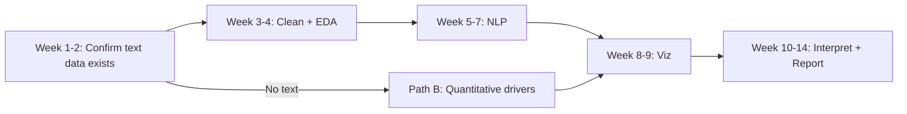

# Project Scope & Complexity Assessment

## Overall rating: **Medium (6/10)**

Achievable for a **4-person team over 14 weeks** with disciplined scope. Complexity rises to **High (8/10)** if you assume rich free-text from all three listed sources without verification.

---

## Complexity by workstream

| Workstream | Rating | Notes |
|------------|--------|-------|
| Literature & governance | Low | 1–2 weeks; Documentation Lead |
| Data acquisition | **High** | Public data ≠ comment-level text |
| Cleaning structured tables | Medium | ODS/Excel, weights, missing codes |
| Text preprocessing | Medium | Stopwords, lemmatization, PII scan |
| Sentiment (VADER, TextBlob) | Low–Medium | Validate on 100 hand-labelled rows |
| LDA topic modelling | Medium | Topic count, coherence, interpretation |
| Dashboard | Low–Medium | Streamlit + plotly |
| Recommendations | Medium | Map topics → PEF/STEEEP domains |

---

## Critical path

**Week 2 decision gate:** Proceed Path A (NLP-full) or Path B (tables + limited text).

---

## Deliverables map

| Objective | Deliverable | Owner |
|-----------|-------------|-------|
| Collect & preprocess | `data/processed/*.csv`, data dictionary | Preprocessing Lead |
| Sentiment & topics | `outputs/` sentiment CSV, LDA topics table | NLP Specialist |
| Drivers & pain points | Top negative themes, trust/setting charts | Viz + NLP |
| Recommendations | Structured by PEF domain | Documentation Lead |
| Dashboard | Streamlit app in `src/dashboard/` | Viz Lead |
| Report | 8k–12k words typical MSc; adjust to brief | Documentation Lead |

---

## Risks & mitigations

| Risk | Impact | Mitigation |
|------|--------|------------|
| No public free-text | Blocks LDA/sentiment | ONS wave; or Path B |
| Low NLP accuracy on clinical text | Weak conclusions | Manual validation sample |
| Team parallelises NLP too early | Rework | Gate at week 2 |
| GPPS 2024 series break | Wrong trends | Annotate charts |
| GDPR in comments | Ethics breach | Strip PII; aggregate reporting only |

---

## Out of scope (unless required by marker)

- Deep learning (BERT, NHS-specific transformers)
- Real-time trust comment scraping
- Primary data collection (new surveys)
- Causal claims (“X causes satisfaction”) — use **association** language

---

## Success criteria

1. Clear answer to **three research questions** with evidence.  
2. At least **one** validated NLP output (sentiment distribution + 5–8 interpretable LDA topics).  
3. **Three+** visualisations linked to recommendations.  
4. Reproducible pipeline from `data/raw` → `outputs/`.  
5. Full acronym and source transparency in appendix.

---

## Next actions (week 1)

1. Team reads `ACRONYM_GLOSSARY.md` (quiz each other on PREM vs PROM, FFT scoring).  
2. Download one ONS wave + one FFT month + one NPSP national table into `data/raw/`.  
3. Fill `data/processed/DATA_DICTIONARY.md` after first `pandas` load.  
4. Sign `ETHICS_AND_GOVERNANCE.md` checklist as a group.
